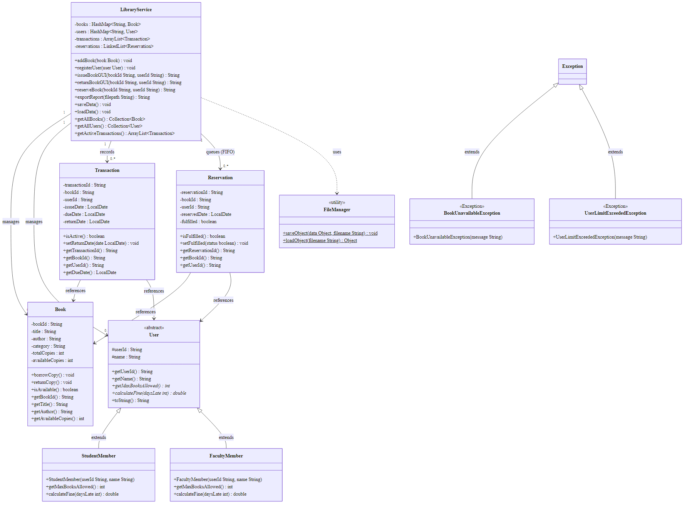

---

# TERM-II PROJECT REPORT

**Course Name:** Object-Oriented Programming with Java

**Project Title:** Smart Library Management System with Reservation and Role-Based Access

**Student Name:** Soumyartho Banerjee

**Roll Number:** 42 (IOT, CS, BT)

**Enrollment Number:** 12024052017013

**Instructor(s):** Dr. Swagatam Basu, Dr. Susovan Jana, Dr. Soumadip Biswas

**Year / Semester:** Spring 2026

---

# 1. Problem Statement

Many small academic libraries continue to manage their records manually or through rudimentary systems. This approach introduces recurring problems: book records go missing, fine calculations are applied inconsistently, due-date tracking is error-prone, and there is no structured way to handle demand for books when every copy has already been issued to a borrower.

Specifically, three major pain points go unaddressed in manual systems:

1. **Inconsistent fine enforcement:** Students and faculty have different borrowing privileges and should attract different daily fine rates on late returns. Manual systems rarely distinguish between user types.
2. **No reservation mechanism:** When all copies of a popular title are issued, a new requester has no formal way to queue for the next available copy. Requests are often forgotten.
3. **Data loss between sessions:** Without persistence, all transaction records are lost when the managing application is closed.

This project proposes and implements a **Smart Library Management System** — a Java-based desktop application that solves all three pain points. Librarians can manage the complete book catalog, register members under two distinct roles (Student and Faculty), issue and return books with automatic due-date assignment, enforce role-specific fines for late returns, queue waiting users through a FIFO reservation system, and export a formatted snapshot report. All data is serialized to disk automatically in the background so that no record is ever lost between sessions.

---

# 2. System Design

## 2.1 Package Structure

The application follows a strict four-layer, separation-of-concerns architecture. Each layer has a single responsibility and communicates only with the layer directly below it.

```
term-ii-project-submission-Soumyartho/
├── src/
│   ├── Main.java                   ← Entry point; wires layers together
│   ├── model/                      ← Data entities (plain Java objects)
│   │   ├── User.java               ← Abstract base class
│   │   ├── StudentMember.java      ← Concrete student user
│   │   ├── FacultyMember.java      ← Concrete faculty user
│   │   ├── Book.java               ← Book entity with copy tracking
│   │   ├── Transaction.java        ← Borrow/return record
│   │   └── Reservation.java        ← Reservation queue entry
│   ├── service/                    ← Business logic
│   │   ├── LibraryService.java     ← Core service class
│   │   ├── BookUnavailableException.java
│   │   └── UserLimitExceededException.java
│   ├── util/                       ← Helper utilities
│   │   ├── FileManager.java        ← Object serialization I/O
│   │   └── DataSeeder.java         ← First-launch sample data
│   └── ui/                         ← Swing GUI components
│       ├── LoginFrame.java
│       ├── DashboardFrame.java
│       ├── AddBookDialog.java
│       ├── RegisterUserDialog.java
│       ├── IssueBookDialog.java
│       └── ReturnBookDialog.java
├── tests/
│   └── LibraryServiceTest.java     ← JUnit test suite
├── data/                           ← Serialized .dat files (runtime)
└── reports/                        ← Exported .txt snapshots
```

## 2.2 UML Class Diagram




## 2.3 Description of Major Classes


| Class | Layer | Responsibility |
|---|---|---|
| `User` | Model | Abstract base; enforces contract for all member types |
| `StudentMember` | Model | Concrete user: 3-book limit, ₹5/day fine |
| `FacultyMember` | Model | Concrete user: 5-book limit, ₹2/day fine |
| `Book` | Model | Tracks catalog entry and available copy count |
| `Transaction` | Model | Records a borrow event with issue/due/return dates |
| `Reservation` | Model | Represents one position in a FIFO queue for a book |
| `LibraryService` | Service | All business logic: issue, return, reserve, search, export, persist |
| `FileManager` | Util | Serializes and deserializes Java objects to/from `.dat` files |
| `DataSeeder` | Util | Populates 8 sample books and 4 users on first launch |
| `LoginFrame` | UI | Welcome screen; transitions to Dashboard |
| `DashboardFrame` | UI | Main UI; houses the book table and action buttons |
| `IssueBookDialog` | UI | Dialog for borrowing a book or triggering a reservation |
| `ReturnBookDialog` | UI | Dialog for returning a book; displays fine on late return |

## 2.4 Interaction Flow

The high-level runtime sequence for the most important user action — **issuing a book** — is as follows:

```
User clicks "Issue Book"
    │
    ▼
IssueBookDialog (UI)
    │  Collects Book ID + User ID from input fields
    ▼
LibraryService.issueBookGUI(bookId, userId)
    │  Validates IDs → checks availability → checks borrow limit
    │
    ├── Book available + user under limit?
    │       YES → creates Transaction, calls book.borrowCopy()
    │             returns "SUCCESS:..." string → dialog shows success
    │
    └── Book unavailable?
            YES → returns "RESERVE:..." string
                  dialog asks user if they want to reserve
                  → LibraryService.reserveBook() adds entry to LinkedList queue
```

When a book is returned, `checkReservationQueue()` is automatically invoked inside `returnBookGUI()` to notify the next waiting user.

---

# 3. OOP Concepts Demonstrated

## 3.1 Abstraction

**Where it is used:** The `User` class in `src/model/User.java`.

**Why it is used:** Not every user is a generic "User." Before any library member can be created, it must be decided what type they are — student or faculty. An abstract class enforces this contract by preventing direct instantiation of `User` and requiring every concrete subclass to provide its own implementations of `getMaxBooksAllowed()` and `calculateFine()`. This eliminates the possibility of a "User with no fine rule" ever existing in the system.

**Code Snippet:**

```java
// src/model/User.java
public abstract class User implements Serializable {

    protected String userId;
    protected String name;

    public User(String userId, String name) {
        this.userId = userId;
        this.name   = name;
    }

    public String getUserId() { return userId; }
    public String getName()   { return name;   }

    // Subclasses MUST define the borrowing limit
    public abstract int getMaxBooksAllowed();

    // Subclasses MUST define the fine calculation rule
    public abstract double calculateFine(int daysLate);
}
```

**Explanation:** Declaring the class `abstract` means `new User(...)` is a compile-time error. The two `abstract` methods act as a specification — any class that extends `User` is legally required to provide concrete implementations. This guarantees that every user in the system always has a meaningful borrowing limit and a fine rule, even if new user types are added in the future.

---

## 3.2 Inheritance

**Where it is used:** `StudentMember` and `FacultyMember` both extend `User`.

**Why it is used:** Both user types share the same identity attributes — `userId` and `name` — along with their associated getters. Rewriting these in both classes would violate the DRY (Don't Repeat Yourself) principle. Inheritance lets both classes reuse the common implementation from `User` while only providing what is unique to each type.

**Code Snippet:**

```java
// src/model/StudentMember.java
public class StudentMember extends User {

    public StudentMember(String userId, String name) {
        super(userId, name);   // delegates to User constructor
    }

    @Override
    public int getMaxBooksAllowed() {
        return 3;
    }

    @Override
    public double calculateFine(int daysLate) {
        return daysLate * 5.0;   // ₹5 per day late
    }
}

// src/model/FacultyMember.java
public class FacultyMember extends User {

    public FacultyMember(String userId, String name) {
        super(userId, name);
    }

    @Override
    public int getMaxBooksAllowed() {
        return 5;
    }

    @Override
    public double calculateFine(int daysLate) {
        return daysLate * 2.0;   // ₹2 per day late
    }
}
```

**Explanation:** The `super(userId, name)` call passes the common attributes up to the parent constructor. Each subclass then overrides only the methods that differ. The HashMap storing users in `LibraryService` is typed as `HashMap<String, User>`, meaning both `StudentMember` and `FacultyMember` objects can coexist in the same collection without requiring separate storage.

---

## 3.3 Polymorphism

**Where it is used:** `LibraryService.returnBookGUI()` calls `user.calculateFine(daysLate)` — the method resolves to the correct implementation at runtime depending on whether the user is a student or faculty member.

**Why it is used:** The return logic must calculate a fine without needing to know the concrete type of the user. Using polymorphism, the same one line of code produces ₹5 per day for students and ₹2 per day for faculty, without any `instanceof` checks or if-else branching.

**Code Snippet:**

```java
// src/service/LibraryService.java  (inside returnBookGUI)
if (returnDate.isAfter(t.getDueDate())) {

    long daysLate = ChronoUnit.DAYS.between(t.getDueDate(), returnDate);

    // user could be StudentMember OR FacultyMember —
    // Java resolves the correct calculateFine() at runtime
    double fine = user.calculateFine((int) daysLate);

    String msg = "Book returned late by " + daysLate +
                 " day(s).\nFine: Rs." + fine;
    return "SUCCESS:" + msg;
}
```

**Explanation:** The variable `user` is declared as type `User` but at runtime it actually holds either a `StudentMember` or a `FacultyMember` object. When `calculateFine(daysLate)` is invoked on it, Java's virtual method dispatch selects the correct override. This is runtime polymorphism in action and is the reason the service layer requires zero modification when a new user type (e.g., `StaffMember`) is added.

---

## 3.4 Encapsulation

**Where it is used:** The `Book` class in `src/model/Book.java`.

**Why it is used:** A book's `availableCopies` counter is critically sensitive state — decrementing it incorrectly (e.g., going below zero) would corrupt the catalog. By making all fields `private`, direct external modification is impossible. The only authorized ways to change the counter are via `borrowCopy()` and `returnCopy()`, which both contain guard conditions.

**Code Snippet:**

```java
// src/model/Book.java
public class Book implements Serializable {

    private String bookId;
    private String title;
    private int totalCopies;
    private int availableCopies;   // private — cannot be set directly

    public boolean isAvailable() {
        return availableCopies > 0;
    }

    public void borrowCopy() {
        if (availableCopies > 0) {  // guard: never goes negative
            availableCopies--;
        }
    }

    public void returnCopy() {
        if (availableCopies < totalCopies) {  // guard: never exceeds total
            availableCopies++;
        }
    }

    public int getAvailableCopies() { return availableCopies; }
}
```

**Explanation:** External code — including `LibraryService` — can only change available copies by calling `borrowCopy()` or `returnCopy()`. Both methods impose boundary checks, so the counter can never go below zero or exceed the total number of physical copies. The business invariant is enforced at the class level, not scattered across multiple callers.

---

# 4. Implementation Highlights

## 4.1 Auto-Save Background Thread

The application launches a daemon thread at startup that automatically saves all library data to disk every 60 seconds. This prevents data loss without requiring the librarian to remember to save manually.

```java
// src/Main.java
Thread autoSaveThread = new Thread(() -> {
    while (true) {
        try {
            Thread.sleep(60000);          // wait 60 seconds
            library.saveData();
            System.out.println("[AutoSave] Data saved in background.");
        } catch (InterruptedException e) {
            System.out.println("[AutoSave] Thread interrupted, stopping.");
            break;
        }
    }
});
autoSaveThread.setDaemon(true);   // exits when the JVM exits
autoSaveThread.setName("AutoSave-Thread");
autoSaveThread.start();

// UI is launched on Swing's Event Dispatch Thread for thread safety
SwingUtilities.invokeLater(() -> new LoginFrame(library));
```

**Justification:** Setting `setDaemon(true)` is essential — it ensures the background thread does not prevent the JVM from shutting down when the user closes the window. Separating the auto-save thread from the main Swing event dispatch thread also maintains UI responsiveness during save operations.

---

## 4.2 FIFO Reservation Queue

When a book is unavailable, users can join a waiting queue. The system uses `LinkedList<Reservation>` as a FIFO queue. On every book return, the queue is automatically consulted.

```java
// src/service/LibraryService.java

// Reservation queue stored as a LinkedList (FIFO structure)
private LinkedList<Reservation> reservations = new LinkedList<>();

public String reserveBook(String bookId, String userId) {
    // Duplicate reservation guard
    for (Reservation r : reservations) {
        if (r.getBookId().equals(bookId) &&
            r.getUserId().equals(userId) && !r.isFulfilled()) {
            return "ERROR:" + user.getName() +
                   " already has a reservation for this book.";
        }
    }
    // Add to back of queue
    reservations.add(new Reservation("R" + (reservations.size()+1),
                                     bookId, userId, LocalDate.now()));
    // Calculate queue position
    int position = 0;
    for (Reservation r : reservations) {
        if (r.getBookId().equals(bookId) && !r.isFulfilled()) position++;
    }
    return "SUCCESS:" + user.getName() + " reserved '" +
           book.getTitle() + "'\nQueue position: " + position;
}
```

**Justification:** `LinkedList` supports efficient `add()` at the tail and provides iteration from the head — matching FIFO semantics exactly. The duplicate guard prevents a user from holding multiple reservations for the same title, keeping the queue fair.

---

## 4.3 Object Serialization for Data Persistence

All runtime data — books, users, transactions, and reservations — is persisted using Java's built-in object serialization through `FileManager`.

```java
// src/util/FileManager.java
public class FileManager {

    public static void saveObject(Object data, String filename) {
        try (ObjectOutputStream out =
                new ObjectOutputStream(new FileOutputStream(filename))) {
            out.writeObject(data);
        } catch (IOException e) {
            System.out.println("Error saving file: " + filename);
        }
    }

    public static Object loadObject(String filename) {
        File file = new File(filename);
        if (!file.exists()) return null;
        try (ObjectInputStream in =
                new ObjectInputStream(new FileInputStream(file))) {
            return in.readObject();
        } catch (Exception e) {
            System.out.println("Error loading file: " + filename);
            return null;
        }
    }
}
```

**Justification:** Java serialization requires model classes to implement `Serializable`. Using try-with-resources (`try (... )`) ensures that streams are automatically closed, even if an exception is thrown, preventing resource leaks. Returning `null` on a missing file (rather than throwing an exception) lets the application start cleanly on the very first run.

---

## 4.4 GUI-Friendly Service API Design

`LibraryService` exposes a dedicated set of methods (e.g., `issueBookGUI`, `returnBookGUI`) that return prefixed String results (`"SUCCESS:..."`, `"ERROR:..."`, `"RESERVE:..."`) instead of `void`. This design choice completely decouples the business logic from the presentation layer.

```java
// src/service/LibraryService.java
public String issueBookGUI(String bookId, String userId) {

    Book book = books.get(bookId);
    User user = users.get(userId);

    if (book == null) return "ERROR:Book ID '" + bookId + "' not found.";
    if (user == null) return "ERROR:User ID '" + userId + "' not found.";

    if (!book.isAvailable()) {
        return "RESERVE:Book '" + book.getTitle() +
               "' is currently unavailable.\nWould you like to reserve it?";
    }
    // ... borrow logic ...
    return "SUCCESS:" + user.getName() + " borrowed '" +
           book.getTitle() + "'\nDue on: " + dueDate;
}
```

**Justification:** The prefix (`SUCCESS`, `ERROR`, `RESERVE`) gives the UI layer a structured protocol to parse without duplicating business logic in dialogs. The same service method works for both unit tests (checking the prefix) and the Swing UI (showing the message in a dialog).

---

## 4.5 Report Export with Formatted Output

The `exportReport()` method in `LibraryService` writes a human-readable snapshot of the entire library state — books, users, transactions, and reservations — to a timestamped `.txt` file in the `reports/` directory.

```java
// src/service/LibraryService.java
public String exportReport(String filepath) {
    try (PrintWriter writer = new PrintWriter(new FileWriter(filepath))) {

        writer.println("--- BOOK CATALOG (" + books.size() + " books) ---");
        writer.println(String.format("%-8s %-25s %-20s %-15s %s",
                       "ID", "Title", "Author", "Category", "Available"));
        for (Book book : books.values()) {
            writer.println(String.format("%-8s %-25s %-20s %-15s %d/%d",
                book.getBookId(), book.getTitle(), book.getAuthor(),
                book.getCategory(),
                book.getAvailableCopies(), book.getTotalCopies()));
        }
        // ... users, transactions, reservations ...
        return "SUCCESS:Report exported to: " + filepath;

    } catch (IOException e) {
        return "ERROR:Failed to write report: " + e.getMessage();
    }
}
```

**Justification:** `String.format()` with fixed-width formatting (`%-8s`, `%-25s`) produces aligned columns in a plain-text file that is immediately readable without any extra tool. The timestamp in the filename (`library_report_2026-03-07.txt`) enables historical archiving without overwriting previous reports.

---

# 5. Testing & Error Handling

## 5.1 Test Cases Considered

The JUnit test suite (`tests/LibraryServiceTest.java`) covers 14 test cases across four functional categories:

| # | Test Method | What It Verifies |
|---|---|---|
| 1 | `testAddBook()` | A new book is retrievable after being added |
| 2 | `testBookAvailability()` | A freshly seeded book reports correct copy count |
| 3 | `testBorrowReducesAvailability()` | `borrowCopy()` decrements the count correctly |
| 4 | `testReturnIncreasesAvailability()` | `returnCopy()` restores the count after borrowing |
| 5 | `testStudentMaxBooks()` | `StudentMember.getMaxBooksAllowed()` returns 3 |
| 6 | `testFacultyMaxBooks()` | `FacultyMember.getMaxBooksAllowed()` returns 5 |
| 7 | `testStudentFineCalculation()` | 5 days late × ₹5 = ₹25.0 for a student |
| 8 | `testFacultyFineCalculation()` | 5 days late × ₹2 = ₹10.0 for a faculty member |
| 9 | `testIssueBookSuccess()` | Successful issue returns `"SUCCESS:..."` and decrements copies |
| 10 | `testIssueBookInvalidBookId()` | Invalid Book ID returns `"ERROR:..."` |
| 11 | `testIssueBookInvalidUserId()` | Invalid User ID returns `"ERROR:..."` |
| 12 | `testIssueBookUnavailable()` | Issuing an out-of-stock book returns `"RESERVE:..."` |
| 13 | `testReserveBook()` | Reservation gives correct queue position |
| 14 | `testDuplicateReservation()` | Re-reserving by the same user returns `"ERROR:..."` |
| 15 | `testReturnBookSuccess()` | Successful return increments copies and returns `"SUCCESS:..."` |
| 16 | `testReturnBookNoTransaction()` | Returning without an active borrow returns `"ERROR:..."` |

## 5.2 Edge Cases Handled

- **Over-borrowing prevention:** Before issuing a book, `LibraryService.issueBookGUI()` counts the user's active transactions. If the count equals `getMaxBooksAllowed()`, the request is rejected with a meaningful error message.
- **Duplicate reservation guard:** If a user attempts to reserve a book they already have in the queue, the method returns an error, keeping the queue fair.
- **Book not found / User not found:** Every service method validates IDs against the HashMap before proceeding, returning a prefixed error on a miss.
- **No active transaction on return:** `returnBookGUI()` scans for an active `Transaction` matching the book and user IDs. If none is found (e.g., the book was never borrowed, or was already returned), an error is returned.
- **Copy counter bounds:** `borrowCopy()` refuses to decrement below zero; `returnCopy()` refuses to exceed `totalCopies`. These guards prevent catalog corruption even in concurrent or unexpected call sequences.

## 5.3 Failure Scenarios and Custom Exceptions

Two custom checked exception classes were created to represent domain-specific error conditions precisely:

**`BookUnavailableException`** — Thrown when a borrow attempt is made for a book with zero available copies. This exception communicates a semantically meaningful state (the book is out) rather than relying on a generic `RuntimeException`.

```java
// src/service/BookUnavailableException.java
public class BookUnavailableException extends Exception {
    public BookUnavailableException(String message) {
        super(message);
    }
}
```

**`UserLimitExceededException`** — Thrown when a user has already borrowed the maximum number of books permitted for their role. This prevents over-issuing without the need for caller-side copy-paste validation logic.

```java
// src/service/UserLimitExceededException.java
public class UserLimitExceededException extends Exception {
    public UserLimitExceededException(String message) {
        super(message);
    }
}
```

These exceptions extend `Exception` (checked), which forces callers to explicitly handle or declare them, making failure paths visible and mandatory at compile time. The GUI layer converts these exceptions into user-friendly dialog messages rather than stack traces.

---

# 6. Git Workflow

## 6.1 Commit History

The project was developed incrementally, with each commit representing a logical, self-contained stage. The commit log (from `git log --oneline`) is shown below:

```
Hash       Date         Commit Message
─────────  ──────────   ──────────────────────────────────────────────────
0e621d4    2026-03-27   (Latest working state — full feature complete)
57d73b8    2026-03-10   Implemented LibraryService with book and user management
e2de4a9    2026-03-08   Implemented User hierarchy with inheritance and polymorphism
72247a5    2026-03-06   Created the package folders
b0ef363    2026-03-05   Create LibraryManagement
5cf5a1f    2026-03-03   add deadline
59939a0    2026-03-02   Initial commit
```

## 6.2 Explanation of Development Progression

The commit history reflects a deliberate bottom-up development strategy:

1. **Initial commit / Project scaffolding (59939a0, b0ef363):** Repository and project skeleton created on GitHub. The basic folder structure was established and the README was drafted with the problem statement.

2. **Package structure (72247a5):** The four-package architecture (`model`, `service`, `util`, `ui`) was committed before any code was written inside them — locking in the design before implementation.

3. **User hierarchy — Core OOP (e2de4a9):** `User.java` (abstract), `StudentMember.java`, and `FacultyMember.java` were implemented together. This commit established the inheritance and polymorphism relationships that the rest of the system depends on.

4. **LibraryService and full business logic (57d73b8):** The central service class was implemented next, depending on the model layer being complete. This included issue, return, reservation, search, export, and persistence logic.

5. **Final polish and integration (0e621d4):** Swing GUI components (`LoginFrame`, `DashboardFrame`, and all dialogs), the JUnit test suite, the `DataSeeder`, and the auto-save background thread were integrated and tested. The `.gitignore` was refined to exclude compiled `.class` files and runtime `data/` files.

This progression ensured that each commit built on a working foundation, minimizing the chance of regressions and making the history easy to follow for any reviewer.

---

# 7. Conclusion & Future Scope

## 7.1 Conclusion

This project successfully demonstrates how Object-Oriented Programming principles — abstraction, inheritance, polymorphism, and encapsulation — can be combined to build a structured, maintainable, and extensible real-world application. The Smart Library Management System satisfies the original problem statement completely:

- Role-based fine calculation is handled transparently through polymorphism without branching in the service layer.
- A FIFO reservation queue ensures fairness when books are unavailable.
- Object serialization provides full data persistence across sessions, with a background auto-save thread adding resilience against accidental session termination.
- The four-layer architecture (Model → Service → Util → UI) ensures that business logic, data representation, and presentation remain independently testable and modifiable.

The 16 JUnit test cases verify correctness of the most critical code paths, and the custom exception classes make error conditions explicit and type-safe.

## 7.2 Future Scope

Several enhancements could meaningfully extend the system beyond its current state:

1. **Authentication System:** Replace the single-button "Enter System" login with a proper credential-based login, with separate roles for librarian admin and read-only view for members.

2. **Email / SMS Notification:** Integrate with JavaMail or an SMS API to automatically notify users when their reserved book becomes available, replacing the console message currently shown to the librarian.

3. **Overdue Fine Automation:** On application startup, scan all active transactions for overdue books and automatically flag them with their accumulated fine instead of computing it only at return time.

4. **Database Backend:** Replace file-based serialization with a relational database (SQLite via JDBC) to support concurrent access, complex queries, and a much larger catalog without loading everything into memory.

5. **PDF Report Generation:** Use a library such as Apache PDFBox or iText to export structured, formatted PDF reports instead of plain-text files.

6. **Book Return Reminders:** Add a periodic background thread that checks for books due within 2 days and generates a reminder list on the dashboard for the librarian.

---

*End of Report*

**Soumyartho Banerjee | Roll No. 42 | Enrollment No. 12024052017013 | Spring 2026**
